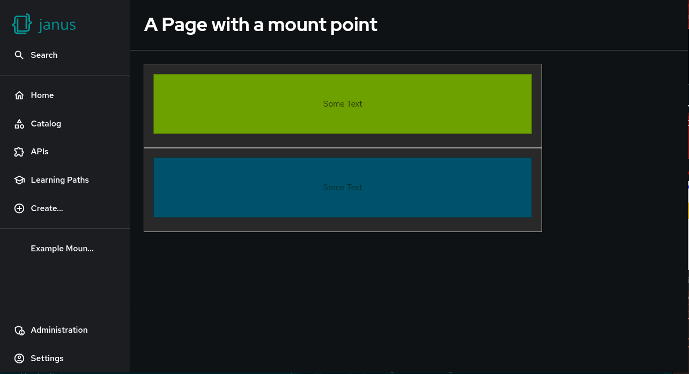

# How to create and use a custom mount point in Red Hat Developer Hub

## Overview

> Note: The Dynamic Plugin functionality is a tech preview feature of Red Hat Developer Hub and is still under active development.  Aspects of developing, packaging and deployment of dynamic plugins are subject to change

This example illustrates how to implement a page that creates a new custom mount point from a dynamic plugin for Red Hat Developer Hub.  The project consists of three plugins:

- plugins/custom-mount-point-host - The plugin that contains a page with a custom mount point
- plugins/simple-test-card-blue - A plugin that exports a blue card
- plugins/simple-test-card-green - A plugin that exports a green card

The example components are composed into a page in Developer Hub using the configuration in [app-config.example.yaml](./app-config.example.yaml).

## Prerequisites

- node 20.x (node 18 may work fine also but untested)
- npm (10.8.1 was used during development)
- yarn (3.8.1 was used during development)

To run this example locally:

- podman (or docker, podman 5.2.2 was used during development)

## Installing and Building

Clone this repository and run the following commands:

```bash
yarn install
```

```bash
yarn tsc
```

```bash
yarn build
```

```bash
yarn export-dynamic
```

## Preparing to run the example

We'll run this example in a container locally, first the exported dynamic plugins must be gathered up into the `dynamic-plugins-root` folder.  Do this by running the included script:

```bash
bash 01-stage-dynamic-plugins.sh
```

When run the `dynamic-plugins-root` folder should look contain the following directories:

- internal.backstage-plugin-custom-mount-point-host-dynamic
- internal.backstage-plugin-simple-test-card-green-dynamic
- internal.backstage-plugin-simple-test-card-blue-dynamic

## Running the example

Once the plugins are in place, use the provided script to launch the Developer Hub container on your local machine:

```bash
bash 02-run-example.sh
```

After verifying there are no errors printed on the console point a browser at [http://localhost:7007/custom-mount-point](http://localhost:7007/custom-mount-point) and the example should be visible.


